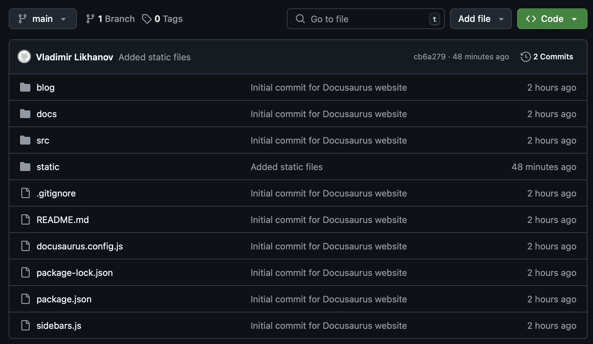

# Deploying Docusaurus Site with GitHub and Netlify

In this tutorial, you will learn how to use Git, GitHub, and Netlify to deploy your Docusaurus site, making it publicly accessible and easy to update.

## Initialize your Git repository

Before deploying your site, ensure that your project (all your Docusaurus-related files) is version-controlled with Git.

1. Navigate to your site directory:

    ```bash
    $ cd my-website
    ```

2. Initialize Git:

    ```bash
    $ git init
    Initialized empty Git repository in ...
    ```

3. Add and commit your project files:

    ```bash
    git add .
    git commit -m "Initial commit for Docusaurus website"
    ```

This sets up a local repository to track your project's changes.

## Create a GitHub repository

Next, create a remote repository on GitHub to host your project.

1. Log in to GitHub and create a new repository. <br />
   Choose a repository name (for example, **my-docusaurus-website**) and set it to public or private as needed.

   
   
2. Link your local repository to GitHub. Replace `your-username` and `repository-name` with your GitHub username and the repository name you just created.

    ```bash
    git remote add origin https://github.com/<your-username>/<repository-name>.git
    git branch -M main
    ```

3. Push your local changes to GitHub:

    ```bash
    git push -u origin main
    ```

This step ensures your website’s source code is safely stored and accessible online via GitHub.



## Connect your repository to Netlify

Netlify provides an efficient way to deploy static sites with continuous deployment built-in.

1. Sign up or log in to Netlify. <br />
   Visit Netlify and log in with your credentials. If you are new to Netlify, you can sign up for a free account.

   

2. Create a new site from Git:

   - Click on **Import existing project** on your Netlify dashboard.

   

   - Select **GitHub** as your Git provider and authorize Netlify to access your GitHub repositories if needed.

   

   - Authorize Netlify to access your GitHub account.

   - Choose the repository that contains your Docusaurus project and click **Install**.

   

3. On the **Let’s deploy your project with** screen, specify the name of your website. Leave all other settings as is. <br />
   
   

4. Deploy your site by clicking **Deploy website_name**. <br />

Netlify will clone your GitHub repository, run the build command, and deploy your site. The process typically takes a few minutes.

##  Continuous deployment and updates

One of the advantages of using GitHub and Netlify is the continuous deployment workflow. Whenever you make changes locally, commit them and push to your GitHub repository, Netlify will detect the changes in your GitHub repository and automatically trigger a new deployment, updating your live site.

```bash
git add .
git commit -m "Update documentation and styling"
git push
```
