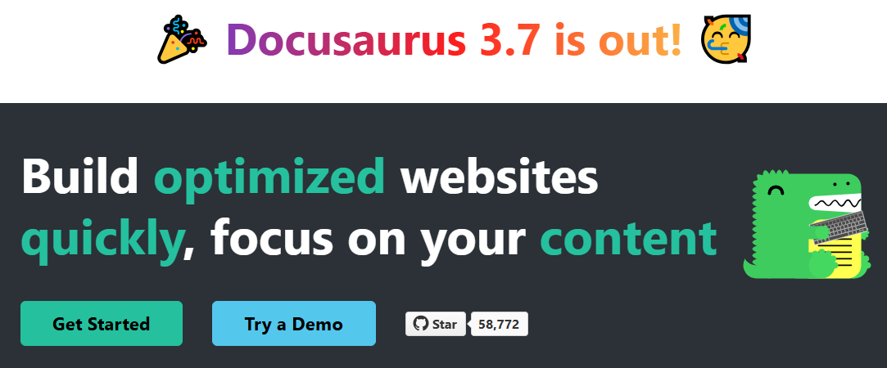
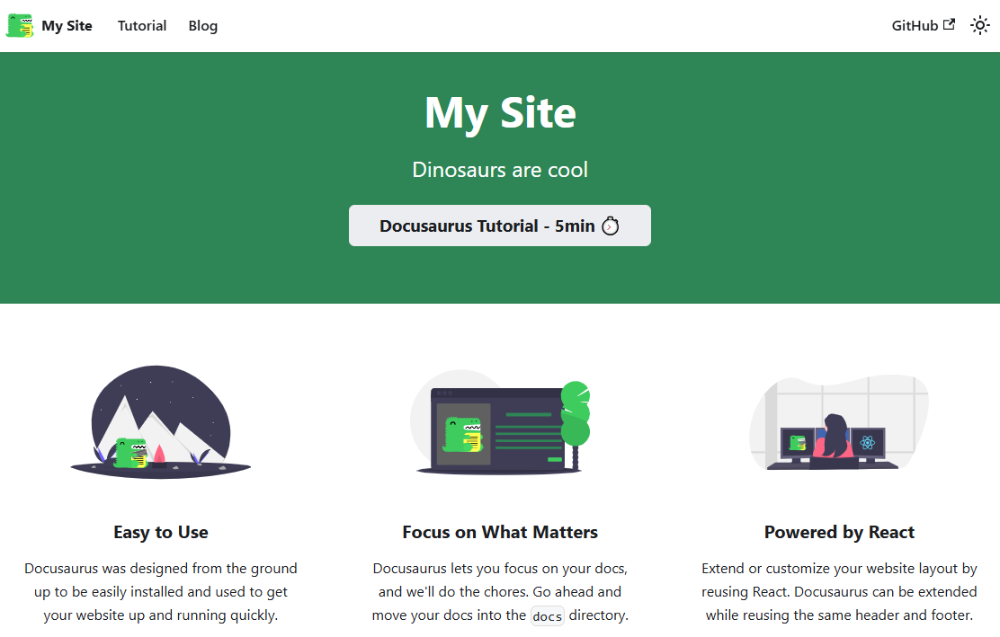


# Quick Start Guide for Deploying Documentation Websites with Docusaurus

Docusaurus is a powerful static-site generator designed to help you create and manage documentation websites with ease. Building upon its predecessors, Docusaurus 3.x introduces several enhancements and new features that streamline the process of setting up, customizing, and deploying documentation sites.



## Key features of Docusaurus

-   **React-powered**: Leverages React to build interactive and dynamic user interfaces.
-   **MDX support**: Allows embedding JSX and React components within Markdown files for rich content creation.
-   **Pluggable architecture**: Offers a modular design where features like documentation, blogs, and pages are implemented as plugins, enabling easy customization and extension.
-   **SEO-friendly**: Generates statically rendered HTML pages, enhancing search engine visibility.
-   **Internationalization (i18n)**: Supports multiple languages, making it easier to cater to a global audience.
-   **Versioning**: Manages different versions of your documentation, ensuring users can access information relevant to specific releases.

## **1. Install Node.js**

Ensure you have Node.js version 18.0 or above installed. You can verify your installation by running this command:

```bash
node -v
```

If Node.js is not installed, follow the instructions at the [official Node.js website](https://nodejs.org/).

#### Example - installing Node.js on Mac using Homebrew

If you're using **macOS**, you can install Node.js with **Homebrew** by following these steps:

1.  Download and install Homebrew (if not already installed). Homebrew is used to manage packages on macOS.
    
    ```bash
    curl -o- https://raw.githubusercontent.com/Homebrew/install/HEAD/install.sh | bash
    ```
    
2.  Install Node.js (latest stable version, e.g., Node.js 22):
    
    ```bash
    brew install node@22
    ```
    
3.  Verify the Node.js installation:
    
    ```bash
    node -v   # Should print "v22.14.0" (or the latest stable version)
    v22.8.0
    ```
    This should print something like `v22.28.1` (depending on the latest stable release).

## 2. Create a new Docusaurus site

Before creating a Docusaurus site, determine where you want to store it on your local machine.  

### Choose a suitable location

Store your site in a dedicated directory within your development workspace. A common structure might be:
```
/Projects  
├── docusaurus-sites  
│ ├── my-website  
│ ├── my-another-website
```
Navigate to your desired location and create a new directory, e.g., `docusarus-sites`.

### Initialize your sroject

Once inside your chosen directory, use the `create-docusaurus` command to set up a new site with the classic template:

```bash
npx create-docusaurus@latest my-website classic
```

Replace **my-website** with your preferred project name. The classic template provides everything needed for a standard website, including:

-   A documentation section
-   A blog
-   Custom pages
-   A CSS framework with built-in dark mode support

After running the command, you see a message indicating that the **create-docusaurus** package is missing and will be installed:

```
npm warn exec The following package was not found and will be installed: create-docusaurus@3.7.0
```

Docusaurus manages dependencies dynamically, so you don’t need to install anything manually before running the setup command. However, you may also see warnings about deprecated packages—these are typically related to underlying dependencies and do not affect the installation process.

Next, you are prompted to choose the programming language for your project. Use the arrow keys to navigate and press Enter to select either:

-   **JavaScript** (default and recommended)
-   **TypeScript**

Once the Docusaurus setup is complete, you’ll see a list of commands you can use to manage your project:

```
[INFO] Inside that directory, you can run several commands:

  `npm start`
    Starts the development server.

  `npm run build`
    Bundles your website into static files for production.

  `npm run serve`
    Serves the built website locally.

  `npm run deploy`
    Publishes the website to GitHub pages.

We recommend that you begin by typing:

  `cd my-website`
  `npm start`

Happy building awesome websites!
```

## 3. Preview your site locally

Once the site setup is complete, move into your newly created site folder and start the Docusaurus development server:

```bash
cd my-website
npx docusaurus start
```

This will start a local server for real-time previews  and enable hot-reloading, so changes you make to your site appear instantly. Once the server is running, open **[http://localhost:3000](http://localhost:3000/)** in your browser to view your site in action.



## Project structure overview

Docusaurus projects have a clear and structured setup that keeps things simple while allowing customization when needed. This makes it easy to manage and extend your documentation site.

Each main folder has a specific role:

-   **`/blog`** – Stores blog posts in Markdown, supporting tags and author details.
-   **`/docs`** – Contains all documentation content, which can be organized into categories and linked in the sidebar.
-   **`/src`** – Holds React components and custom pages beyond the documentation.
-   **`/static`** – Keeps static files like images and PDFs, which are copied directly into the final site.

The site is controlled by key configuration files:

-   **`docusaurus.config.js`** – Defines global settings, navigation, and plugins.
-   **`sidebars.js`** – Organizes the documentation sidebar for easy navigation.

This structure helps you work efficiently and ensures a consistent experience as your documentation grows.

### Next Steps

Once your Docusaurus project is set up, you can take the following steps to build and launch your documentation site:

-   **Add content** – Write documentation, blog posts, and custom pages to populate your site.
-   **Customize the appearance** – Modify themes, styles, and layouts to match your brand or design preferences.
-   **Deploy your site** – Build and publish your documentation online using platforms like:
    -   **GitHub pages** (ideal for open-source projects)
    -   **Vercel** (fast and optimized for frontend frameworks)
    -   **Netlify** (popular for static site hosting with automation features)

With these steps, you can create a well-structured, visually appealing, and publicly accessible documentation site.
